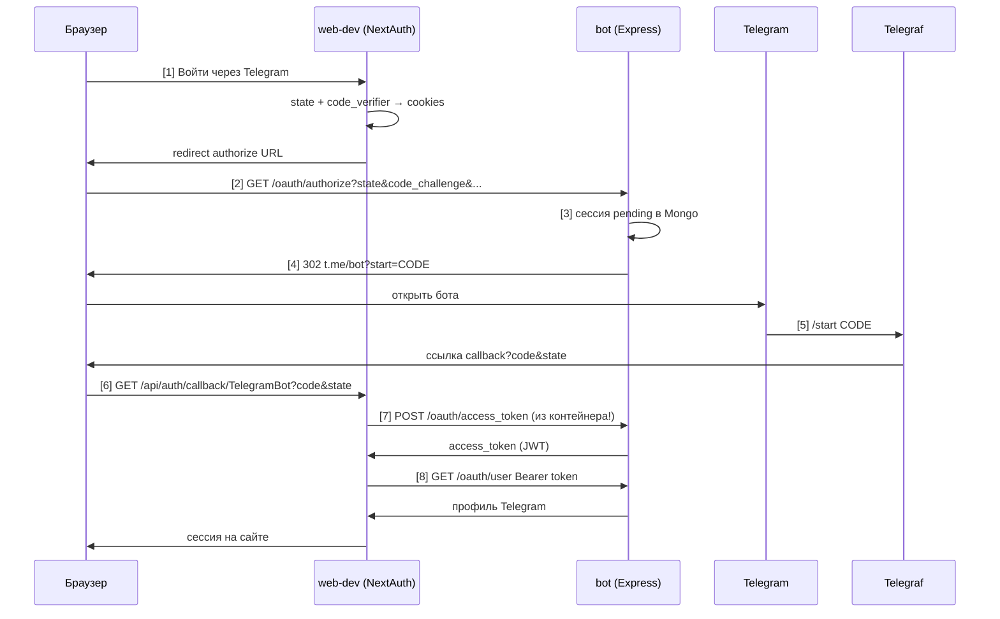

# OAuth через Telegram-бота — полный flow

Документ описывает, как устроен вход на сайт через кастомный OAuth-провайдер **TelegramBot** (NextAuth) и бота на Payload + Express + Telegraf.

Если читаешь через год — начни с [схемы](#схема-целиком) и [таблицы шагов](#пошагово-8-шагов).

---

## Участники

| Участник     | Где живёт                                     | Роль                                                 |
| ------------ | --------------------------------------------- | ---------------------------------------------------- |
| **Браузер**  | Mac (хост)                                    | Редиректы authorize, callback, cookies PKCE/state    |
| **web-dev**  | Docker-контейнер Next.js                      | NextAuth, callback, server-to-server token/user      |
| **bot**      | Docker-контейнер Payload + Express + Telegraf | OAuth IdP, Telegram, Mongo                           |
| **NextAuth** | внутри web-dev                                | Провайдер `TelegramBot`, `checks: ["pkce", "state"]` |

---

## Файлы в репозитории

| Файл                                                   | Назначение                                                     |
| ------------------------------------------------------ | -------------------------------------------------------------- |
| `src/bot/controllers/oauth.ts`                         | HTTP: `/oauth/authorize`, `/oauth/access_token`, `/oauth/user` |
| `src/bot/start-bot.ts`                                 | Telegram `/start` — подтверждение входа, ссылка callback       |
| `src/bot/services/oauth.ts`                            | Работа с Mongo (Payload): клиенты и сессии                     |
| `src/lib/schemas.ts`                                   | Zod-схемы query/body                                           |
| `src/entities/user/model/next-auth-config.ts` (корень) | Конфиг провайдера NextAuth                                     |

---

## Две коллекции Payload (не путать!)

### `oauthClients` — зарегистрированные приложения

Постоянные записи из админки Payload.

- `client_id`, `client_secret`
- `redirect_uris[]` — whitelist callback URL (напр. `http://localhost:3000/api/auth/callback/TelegramBot`)

**Секрет в админке должен совпадать с `BOT_CLIENT_SECRET` в корневом `.env`**, иначе на token будет `Client not found`.

### `oauthCodeClient` — одна попытка входа

Живёт ~15 минут, одноразовая.

| Поле                    | Откуда                      | Зачем                                               |
| ----------------------- | --------------------------- | --------------------------------------------------- |
| `code`                  | генерирует бот              | ключ для `?start=` в Telegram и `?code=` в callback |
| `status`                | `pending` → `confirmed`     | token только после Telegram                         |
| `state`                 | query authorize от NextAuth | вернуть в callback-ссылке                           |
| `code_challenge`        | query authorize (PKCE)      | проверка на token                                   |
| `code_challenge_method` | обычно `S256`               | алгоритм PKCE                                       |
| `redirect_uri`          | query authorize             | куда слать ссылку из Telegram                       |
| `user`                  | JSON `ctx.from` Telegraf    | профиль после /start                                |
| `expires_at`            | now + 15 min                | TTL сессии                                          |

---

## Схема целиком



---

## Пошагово (8 шагов)

### [1] Старт входа на сайте

**Кто:** браузер → Next.js  
**Где:** `POST /api/auth/signin/TelegramBot`

NextAuth:

1. Генерирует `state` (CSRF) → cookie `next-auth.state`
2. Генерирует `code_verifier` (PKCE) → cookie `next-auth.pkce.code_verifier`
3. Считает `code_challenge = BASE64URL(SHA256(code_verifier))`
4. Отдаёт браузеру URL authorize (сам на бота **не** ходит)

В логах web:

```
CREATE_STATE { value: '...' }
CREATE_PKCECODEVERIFIER { value: '...' }
GET_AUTHORIZATION_URL { url: 'http://localhost:3001/oauth/authorize?...' }
```

---

### [2] Authorization endpoint

**Кто:** браузер (не сервер!)  
**Куда:** `GET {BOT_PUBLIC_URL}/oauth/authorize`  
**Код:** `controllers/oauth.ts` → `router.get("/authorize")`

Пример query:

```
client_id=svt
response_type=code
redirect_uri=http://localhost:3000/api/auth/callback/TelegramBot
state=xlqdfQsdhKpFI9i-...
code_challenge=POtch1_qJ8D...
code_challenge_method=S256
```

Почему браузер, а не Next.js: так устроен OAuth 2.0 — authorize для user-agent.

---

### [3] Валидация и создание сессии

**Код:** `OauthService.findOauthClient` → проверка `redirect_uris` → `createOauthClient`

1. Есть ли `client_id` в `oauthClients`
2. `redirect_uri` в whitelist
3. Создать документ `oauthCodeClient`: `status=pending`, сохранить state, PKCE, redirect_uri
4. Сгенерировать внутренний `code` (32 hex-символа)

---

### [4] Редирект в Telegram

**Ответ:** `302 {TELEGRAM_BOT_URL}?start={code}`

`TELEGRAM_BOT_URL` из `bot/.env`, напр. `https://t.me/oauth_bot_svt_bot`.

`code` в deep link = ключ сессии в Mongo (тот же потом уйдёт в callback как OAuth `code`).

---

### [5] Подтверждение в Telegram

**Код:** `start-bot.ts` → `bot.start`  
**Кто:** пользователь жмёт Start, Telegraf получает `ctx.payload = code`

1. `updateOauthCodeClient`: `user = JSON.stringify(ctx.from)`, `status = confirmed`
2. Собрать ссылку:

```
{redirect_uri}?code={session.code}&state={session.state}
```

3. Отправить plain-text URL в чат (Telegram сам сделает ссылку кликабельной)

**Важно:**

- Без `state` в URL → `state missing from the response`
- Открывать ссылку **в том же браузере**, где начали вход (PKCE cookie)
- HTML `<a href="localhost">` и inline-кнопки с HTTP в Telegram не работают нормально в dev

---

### [6] Callback NextAuth

**Кто:** браузер  
**Куда:** `GET /api/auth/callback/TelegramBot?code=...&state=...`

NextAuth сверяет `state` из URL с cookie. Дальше **сервер** web-dev обменивает code на token.

---

### [7] Token endpoint

**Кто:** сервер Next.js в контейнере `web-dev`  
**Куда:** `POST {AUTHORIZATION_BOT_URL}/oauth/access_token` → `http://bot:3001/...`  
**Код:** `controllers/oauth.ts` → `router.post("/access_token")`

**Заголовок:**

```
Authorization: Basic base64(client_id:client_secret)
```

**Тело:**

```
grant_type=authorization_code
code=...
redirect_uri=http://localhost:3000/api/auth/callback/TelegramBot
code_verifier=...   ← из cookie NextAuth, не из бота
```

**Проверки по порядку:**

1. `client_id` + `client_secret` (совпадение с `oauthClients`)
2. Сессия `confirmed` + тот же `client_id` + тот же `code`
3. Не истёк `expires_at`
4. Есть `user` (Telegram)
5. PKCE: `BASE64URL(SHA256(code_verifier)) === code_challenge`
6. Удалить сессию (code одноразовый)
7. Выдать JWT:

```json
{
  "access_token": "...",
  "token_type": "Bearer",
  "expires_in": 3600
}
```

JWT payload = Telegram user, подпись `AUTH_SECRET` из `bot/.env`.

---

### [8] UserInfo endpoint

**Кто:** сервер web-dev  
**Куда:** `GET {AUTHORIZATION_BOT_URL}/oauth/user`  
**Заголовок:** `Authorization: Bearer {access_token}`

NextAuth вызывает `profile()` в `next-auth-config.ts` и создаёт пользователя/сессию на сайте.

---

## PKCE — подробно

| Момент      | Что происходит                                             |
| ----------- | ---------------------------------------------------------- |
| Старт входа | NextAuth: `verifier` → cookie, `challenge` → URL authorize |
| Authorize   | Бот сохраняет **challenge** в Mongo                        |
| Token       | NextAuth шлёт **verifier** в POST body                     |
| Бот         | Пересчитывает challenge из verifier и сравнивает           |

Формула для `S256`:

```
code_challenge = BASE64URL( SHA256( code_verifier ) )
```

Base64URL = обычный Base64, но `+` → `-`, `/` → `_`, убрать `=` в конце.

**Не путать:** `BASE64URL(code_verifier)` без SHA256 — неверно.

---

## Docker и сеть

### Два URL бота

| Переменная              | Пример                  | Кто использует        |
| ----------------------- | ----------------------- | --------------------- |
| `BOT_PUBLIC_URL`        | `http://localhost:3001` | Браузер → authorize   |
| `AUTHORIZATION_BOT_URL` | `http://bot:3001`       | web-dev → token, user |

### Почему не один `localhost:3001`

```
Браузер на Mac:     localhost:3001 → bot ✅ (port mapping)
Контейнер web-dev:  localhost:3001 → сам web-dev ❌ ECONNREFUSED
Контейнер web-dev:  bot:3001       → контейнер bot ✅
```

`localhost` внутри контейнера = этот контейнер, не хост и не сосед.

---

## Переменные окружения

### Корневой `.env` (web)

```env
BOT_CLIENT_ID=svt
BOT_CLIENT_SECRET=...          # = client_secret в Payload oauthClients
BOT_PUBLIC_URL=http://localhost:3001
AUTHORIZATION_BOT_URL=http://bot:3001
NEXTAUTH_URL=http://localhost:3000
```

После смены `.env`:

```bash
docker compose -f docker-compose.yml -f docker-compose.dev.yml up -d --force-recreate web
```

### `bot/.env`

```env
BOT_TOKEN=...                  # @BotFather
TELEGRAM_BOT_URL=https://t.me/your_bot
AUTH_SECRET=...                # подпись JWT access_token
PAYLOAD_SECRET=...
DATABASE_URI=mongodb://mongo/bot   # в Docker
PORT=3001
```

---

## Типичные ошибки (чеклист)

| Ошибка                            | Причина                                     | Решение                                 |
| --------------------------------- | ------------------------------------------- | --------------------------------------- |
| `state missing from the response` | В ссылке из Telegram нет `state`            | Добавить `&state=` в `start-bot.ts`     |
| `ECONNREFUSED` на callback        | web бьётся в `localhost:3001` из контейнера | `AUTHORIZATION_BOT_URL=http://bot:3001` |
| `Client not found`                | secret в Payload ≠ `BOT_CLIENT_SECRET`      | Синхронизировать в админке              |
| `Invalid code_verifier`           | Неверный PKCE или другой браузер            | Тот же браузер; формула S256            |
| `404` на callback                 | Нет `/oauth/user` или старый код бота       | Реализовать роут, перезапустить bot     |
| Authorize ок, token нет           | POST вместо GET на access_token             | `router.post`                           |

---

## Настройка Payload Admin

1. Коллекция **oauthClients**: создать клиента
   - `client_id` = `BOT_CLIENT_ID`
   - `client_secret` = `BOT_CLIENT_SECRET`
   - `redirect_uris`: `http://localhost:3000/api/auth/callback/TelegramBot`
2. Коллекция **oauthCodeClient** — только для отладки, сессии создаёт код

---

## NextAuth (корень проекта)

```ts
checks: ["pkce", "state"],
authorization: { url: `${BOT_PUBLIC_URL}/oauth/authorize` },
token: `${AUTHORIZATION_BOT_URL}/oauth/access_token`,
userinfo: `${AUTHORIZATION_BOT_URL}/oauth/user`,
```

Без `checks: ["pkce", "state"]` в authorize не придут `code_challenge` и нормальный `state`.

---

## Ссылки на код

- [oauth.ts (controller)](../src/bot/controllers/oauth.ts)
- [oauth.ts (service)](../src/bot/services/oauth.ts)
- [start-bot.ts](../src/bot/start-bot.ts)
- [next-auth-config.ts](../../src/entities/user/model/next-auth-config.ts)
